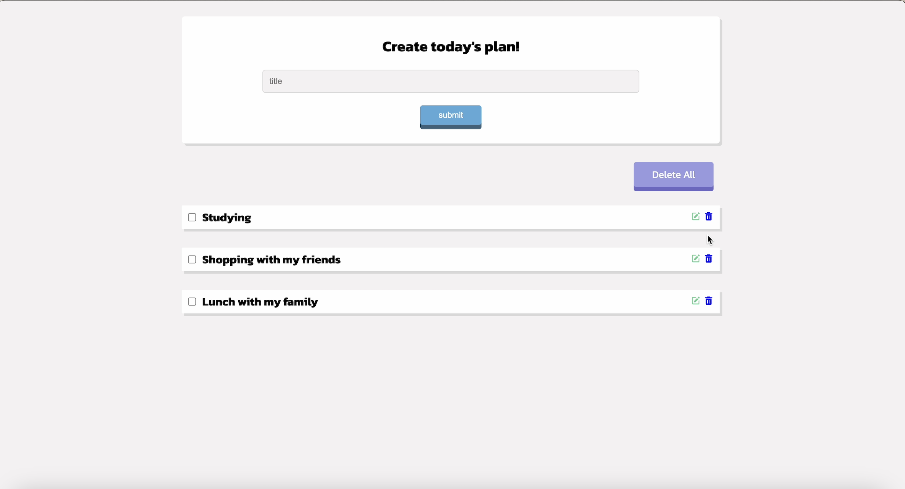

I created the pretty simple to-do list to understand APIs using express.js, axios, mongoDB.
If you would like to use this to-do list in your local, please download these files and browse localhost:3000.

