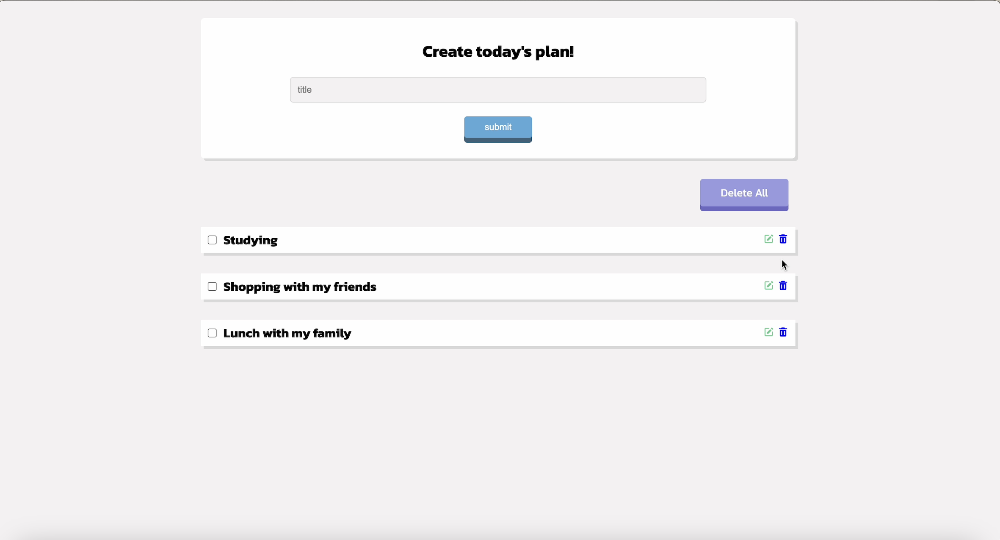

I created a simple to-do list to understand APIs using Express.js, Axios, and MongoDB. If you would like to use this to-do list locally, please download these files and visit 'localhost:3000' in your browser.

